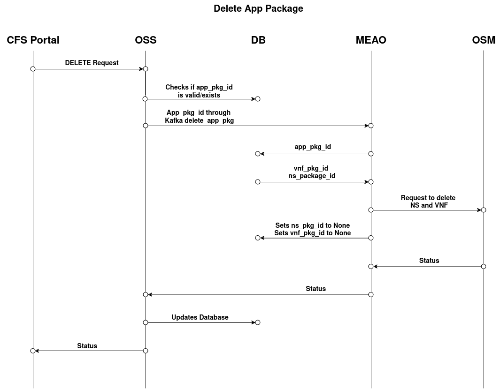
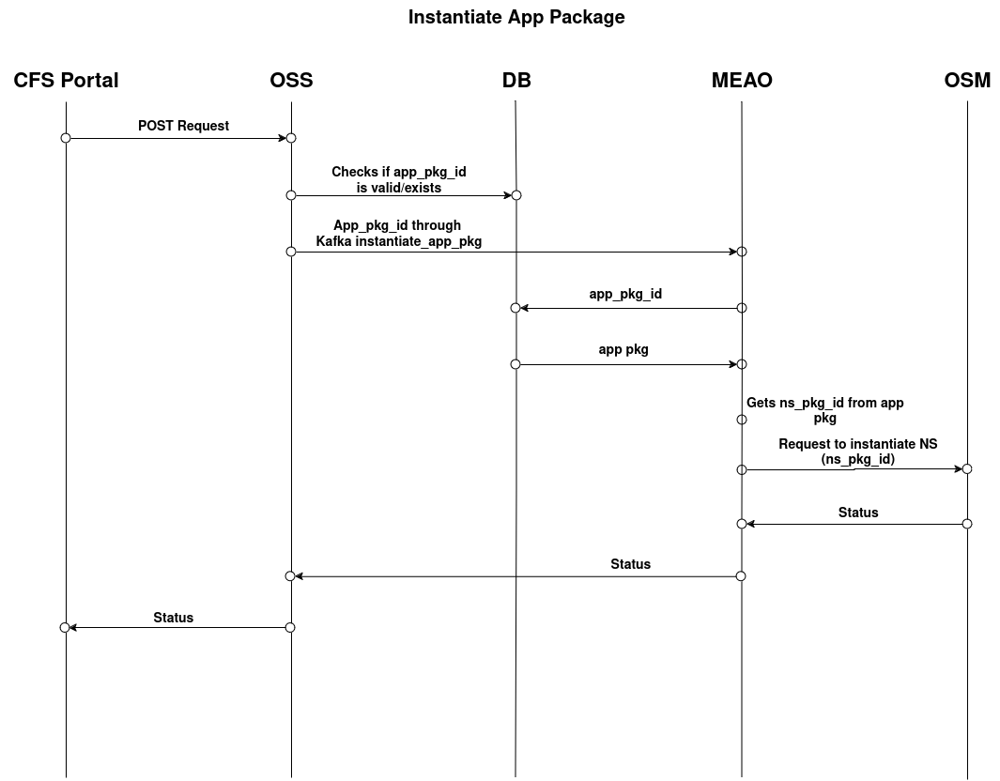
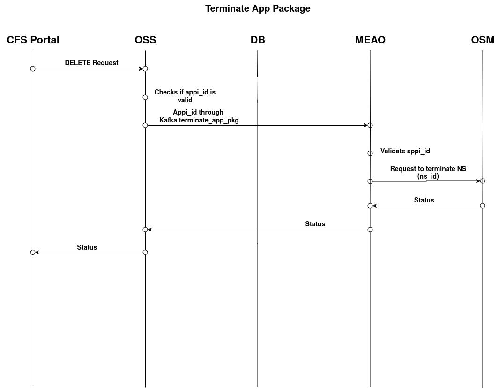

# API Request Flows

## App Package

### POST

### GET (List)

## App Package/\{app_pkg_id\}

### GET (Individual Package)

### PUT

### DELETE

## App Package/\{app_pkg_id\}/instantiate

### Instantiate

### Terminate

